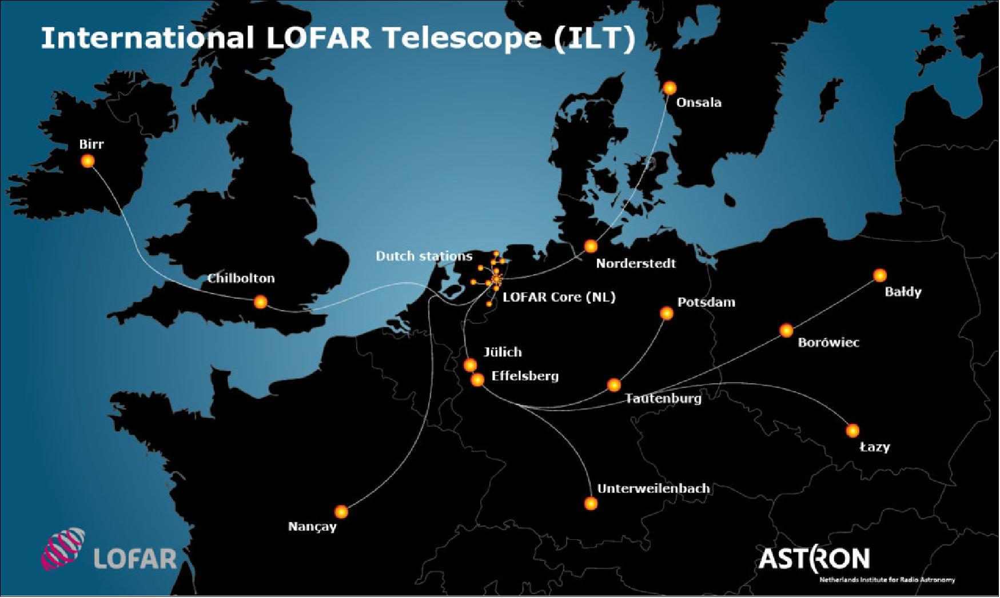
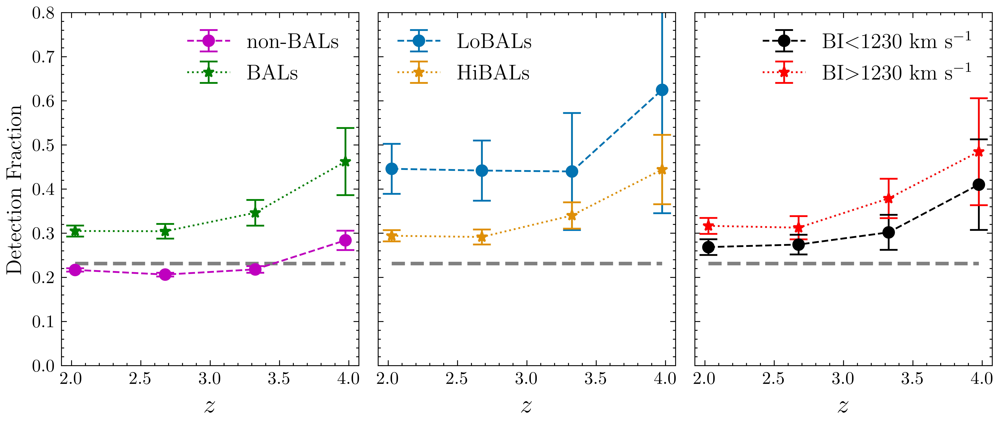

# I have been published!

In the summer of 2022 I had my first paper published in a peer-reviewed journal (The Monthly Notices of the Royal Astronomical Society). This was quite an emotional and proud moment for me and the culmination of a goal I've had for probably the past 3 or 4 years. The whole process took quite a long time; I had originally created a draft of the paper, albeit with a very different aim and methods, in July 2021 so it took almost a year to get to a finished and published product.

In this short post I hope to give a quick overview of the work for non-experts in astronomy and give an idea of the kind of problems we tackle and the questions we are asking in the various groups I am a part of.

## The Topic

The paper is concerned with a particular group of luminous black hole systems called Broad Absorption Line Quasars (BALQSOs). These differ from standard quasar systems (so named because when they were first discovered they looked like point-like, therefore star-like, sources but turned out to be too distant and too bright to actually be stars) in that they have large amounts of gas outflowing from them. We can see this gas when we split light coming from the quasar into all of it's components, like with white light through a glass prism, and we observe certain parts of the spectrum are absorbed and shifted from where we expect them to be.

These outflows are often referred to as winds (about the fastest wind you could possibly imagine!). The winds have enough energy to potentially alter the future evolution of the entire galaxy in which they reside. However, clear evidence of this effect has not been observed and since these features are only seen in around 10-20% of quasars, their importance to the whole population is quite uncertain.

## Radio Studies

In radio astronomy we detect radio signals from around the universe that are much fainter then the radio messages humanity is sending all the time. To be able to do extra-terrestrial observations, agreements have been made with governments and commercial entities to ensure that there is radio frequency space for astronomy. Astronomical radio emission tends to be dominated by the acceleration of electrons in magnetic fields. As electrons move around a magnetic field they emit light through a process called synchrotron emission and this feature peaks in radio frequencies.

There are several different physical environments in which this emission can be produced but probably the most famous are dramatic radio jets. These are super-fast streams of particles produced by black holes that end up expanding to many times the size of the galaxy.

These sources are incredibly beautiful but are also incredibly rare. Most black hole systems do not exhibit this kind of behaviour and tend to appear as smaller, faint blobs with current radio astronomy surveys.

When we perform a survey of quasars and then look to measure the fraction of sources that are also observed by a radio telescope, we find a peculiar result. The fraction of BALQSOs, the quasars with winds, that have radio detections is higher than that for other "normal" quasars. This has been known for a while (maybe two decades) but where this radio emission is coming from and whether it has any relevance to the importance of the population is an open question. This is the question I am trying to answer in the paper and the PhD more generally.

## The Data

For a population study like this, the more quasars we have to play with the better since it makes our statistics and conclusions more reliable. Fortunately, in recent years, large scale astronomy surveys have become more and more prevalent and we can actually build quite a large sample of these extreme objects.

To identify quasars, in this work we used the Sloan Digital Sky Survey (SDSS). This survey has been on going since the year 2000 and has taken over 4 million spectra of different sources. This project is still ongoing and astronomers can freely access the data which is packaged into different releases.

For the radio data we use a survey named the LOFAR Two metre Sky Survey (LoTSS). LOFAR because it uses the LOFAR radio telescope and two metre because the radio wavelength it observes is two metres long. The LOFAR radio telescope has stations all around Europe and is one of the most sensitive telescopes we have, particularly at this wavelength.

## What to do with it?

We start by matching the two surveys. This means we pick the same region of the sky, the one covered by LoTSS since it is currently smaller, and find all the quasars that do and do not have radio detections. We then extract those quasars that do have winds and those that do not. We can now compare these different populations with respect to each other and see if we can extract information as to what is going on.

We want to know why the quasars with winds are more likely to be radio detected than normal quasars. So the main things we want to look at are:

1. Is there any other information beyond the presence of the wind that is useful for predicting radio emission? (This could point towards an explanation)
2. What do the spectra of the radio detected wind and non-wind quasars look like compared to each other?
3. What do the **changes** between radio and non-radio groups look like compared to each other?
4. Beyond just detection, does the brightness of the radio emission change between the two groups?

### 1 - Other Information

We look at the radio detection fractions of different groups. To see if we can find a useful predictor.

